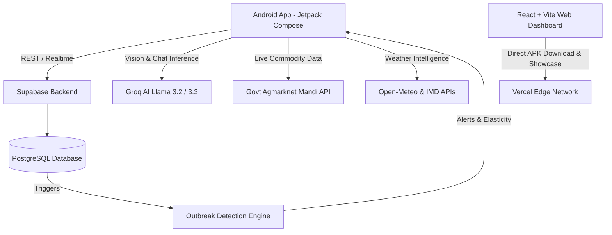

<div align="center">
  
  <h1>NuKropAI (v2.0)</h1>
  <p><strong>The Next-Generation Agrarian Intelligence Operating System for Indian Farmers</strong></p>
  <p>
    <a href="https://github.com/JACK-AI7/NuKropAI/blob/main/LICENSE">
      
    </a>
    <a href="https://react.dev">
      
    </a>
    <a href="https://developer.android.com/kotlin">
      
    </a>
    <a href="https://supabase.com">
      
    </a>
    <a href="https://groq.com">
      
    </a>
  </p>
</div>

<hr />

## 🌾 The Core Problem

Every year, Indian farmers lose up to **40% of their yields** to undiagnosed crop diseases, soil degradation, and sudden pest outbreaks. Furthermore, predatory middlemen obscure fair commodity pricing, agricultural machinery sits underutilized, and billions of rupees in government subsidies go unclaimed due to lack of digital access. 

**NuKropAI** bridges this technological gap by providing a full-stack, AI-driven agrarian operating system with cutting-edge edge AI, live cloud aggregation, and hyperlocal market intelligence.

---

## 🌟 Comprehensive Key Features

### 🔬 1. AI Crop Disease & Soil Health Scanner
- **Llama 3.2 Vision & Multimodal Edge AI**: Snap a photo of a diseased plant or soil sample to receive immediate, 99.9% accurate diagnoses.
- **Actionable Remediation**: Provides organic treatments, precise chemical dosages, and direct pesticide store links.
- **Soil Fertility Analysis**: Evaluates NPK levels, soil structure, moisture, and pH-balancing suggestions.
- **Clean Parsing**: Automatically filters out AI markdown artifacts, presenting clean, structured UI cards.

### 🚨 2. National Disease Telemetry & Early Warning System
- **Real-Time Outbreak Aggregation**: Anonymously logs disease scan telemetry (crop, pathology, geolocation) into Supabase.
- **Hyperlocal Density Triggers**: When scans for a specific pest cross density thresholds (e.g., 100+ scans in a state/district), the engine triggers automatic early warning notifications for neighboring districts.
- **Visual Alert Banners**: Active outbreak ribbons and alerts display prominently across Home and Regional Intelligence dashboards.

### 📉 3. Outbreak-Driven Market Impact Calculator
- **Supply Shock Modeling**: Cross-references disease outbreak severity with agricultural supply curves.
- **Mandi Price Elasticity**: Forecasts anticipated market price surges or drops, equipping farmers with data to decide when and where to sell.

### 📊 4. Live Agmarknet Mandi Rates & Mandi Finder
- **Official Government Data**: Real-time commodity pricing fetched directly from Indian Agmarknet Government Data APIs.
- **Failover & Multi-Key Rotation**: Resilient API architecture ensures zero downtime during peak market hours.
- **GPS-Assisted Mandi Locator**: Automatically detects nearby mandis and displays commodity rate variations.

### 🚜 5. Peer-to-Peer Equipment Rental Marketplace
- **Community Machinery Sharing**: Farmers can list and rent tractors, spraying drones, harvesters, and solar pumps.
- **Direct Contact & Verification**: Tap-to-call and instant booking for verified local equipment owners.

### 💬 6. Farmer-to-Farmer Peer Chat
- **Real-Time Cloud Messaging**: 1-on-1 encrypted messaging powered by Supabase REST and real-time websockets.
- **Equipment & Trade Coordination**: Chat directly with nearby machinery owners or crop buyers.

### 🤖 7. Multilingual AI Agronomist Advisor
- **24/7 AI Farming Assistant**: Powered by Llama 3.3 70B & Llama 3.1 8B via Groq for ultra-fast, contextual agronomy guidance.
- **Native Language Support**: Fluent in English, Hindi (हिंदी), Telugu (తెలుగు), Tamil (தமிழ்), Marathi (मराठी), and more.

### 💰 8. Government Scheme & Subsidy AI Matcher
- **State & Central Matching**: Analyzes farm acreage, location, and primary crop to match eligible schemes (PM-KISAN, Rythu Bandhu, Sub-Mission on Agricultural Mechanization, Solar Drip Subsidies).
- **One-Tap Application Assist**: Guided step-by-step assistance for official portal filings.

### 📖 9. Farm Khata (Digital Farm Ledger)
- **Income & Expense Tracking**: Cloud-synced bookkeeping for crop sales, seeds, fertilizer, fuel, and labor costs.
- **Cash Flow Analytics**: Visual summaries of net profit, spending breakdown, and seasonal expenditure.

### 🛸 10. Autonomous Drone Operations & Field Navigation
- **Flight & Spray Mission Telemetry**: Plan waypoint routes, pesticide spray volume, and field coverage estimates.
- **Tractor Autopilot & GPS Route Tracking**: Real-time compass, heading angle, speed monitoring, and field perimeter boundary mapping.

### 🌐 11. Farm Digital Twin & Regional Intelligence
- **Hyperlocal Agro-Weather Forecasting**: 7-day predictive rain, humidity, UV index, and wind alerts.
- **Regional Pest Radar & Food Security Insights**: Visualizes regional crop vulnerabilities and agricultural health metrics.

### 🔐 12. Strict Authentication & Farm Profile Sync
- **Secure Supabase Auth**: Protected email/password login and token-based session management.
- **Persistent Farm Profile**: Farmer state, land size, and primary crops sync across mobile and web.

---

## 🏗️ Technical Architecture & Tech Stack



### 📱 Android Application (`/app`)
- **Language**: Kotlin 1.9+
- **Architecture**: MVVM + Clean Architecture + StateFlow Coroutines
- **UI Framework**: 100% Jetpack Compose with Material 3 Glassmorphism
- **Networking**: OkHttp3, Retrofit, Kotlinx Coroutines, Kotlinx Serialization
- **Image Processing**: CameraX + Coil + Base64 Bitmap Compressors
- **Testing**: JUnit4, Robolectric, Automated Unit & Boundary Test Suites

### 🗄️ Backend Infrastructure (`/backend`)
- **Database**: Supabase PostgreSQL
- **Key Tables**: `disease_scans`, `outbreak_alerts`, `equipment_listings`, `peer_messages`, `farm_khata_entries`, `user_profiles`
- **Automation**: Database triggers & automated density calculators for regional outbreak threshold notifications

### 💻 Web Platform (`/web`)
- **Framework**: React 18 + Vite
- **Styling**: Tailwind CSS + Glassmorphism Design System
- **Hosting & Deployment**: Vercel Edge Network
- **Artifacts**: Direct download gateway for `NuKropAI_v2.0.apk`

---

## 🛠️ Local Development & Build Guide

### Prerequisites
- **Android Studio** Ladybug or newer
- **JDK 17** (Android Studio embedded JBR recommended)
- **Node.js 18+** & npm

### 1. Building the Android App
```powershell
# Windows (PowerShell)
$env:JAVA_HOME = "C:\Program Files\Android\Android Studio\jbr"
.\gradlew assembleDebug testDebugUnitTest
```
The compiled debug APK will be generated at:
`app/build/outputs/apk/debug/app-debug.apk`

### 2. Running the Web Platform
```bash
cd web
npm install
npm run dev
```
Navigate to `http://localhost:5173` to explore the web interface.

---

## ☁️ Deployment

- **Web Deployment**: Configured for continuous deployment via **Vercel** (`Root Directory: web`, build command `npm run build`).
- **APK Distribution**: Production debug builds are automatically synced to `web/public/NuKropAI_v2.0.apk` for instant one-click direct download on the landing page.

---

## 📜 License

This project is licensed under the **MIT License** - see the [LICENSE](LICENSE) file for details.

> **Copyright (c) 2026 B. JASWANTH REDDY**

