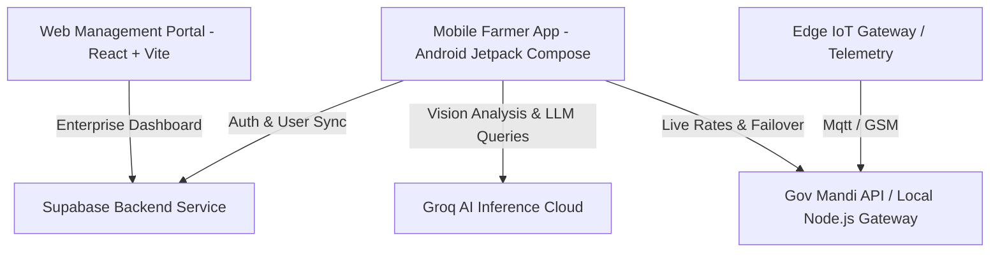

# 🌾 NuKropAI — Autonomous Agriculture AI Operating System

[](https://github.com/JACK-AI7/NuKropAI)
[](https://github.com/JACK-AI7/NuKropAI)
[](https://kotlinlang.org/)
[](https://developer.android.com/studio)
[](https://nodejs.org/)
[](https://supabase.com/)
[](https://groq.com/)

**NuKropAI** is an enterprise-grade, full-stack smart agriculture operating system designed to empower farmers, agronomists, and agricultural enterprises with AI-driven vision diagnostics, real-time market data, telemetry, and automated crop management tools.

---

## 🚀 Key Modules & Features

### 🌿 1. AI Crop Disease Scanner & Soil Health Analysis
* **Groq Vision LLM Integration**: Multi-model fallback (`llama-3.2-11b-vision-preview`, `llama-3.2-90b-vision-preview`) for instant visual disease diagnosis on crop leaves and stems.
* **Treatment & Product Matching**: Returns exact disease names, severity levels, confidence scores, and real brand-name Indian agricultural products (pesticides, fungicides) with precise dosages and purchase links.
* **Soil Composition & NPK Estimator**: Evaluates soil texture, pH range, organic matter content, and NPK deficiency recommendations.

### 🔐 2. Enterprise Authentication & User Management
* **Supabase Integration**: Auth engine backed by Supabase Kotlin SDK (`auth-kt`). Supports email/password authentication, persistent user sessions, metadata synchronization, and guest modes.
* **Secure Profile & Data Security**: Full user profile customization with fallback metadata extraction.

### 📊 3. Live Mandi Market Intelligence & Price Ticker
* **Real-time Government API Ingestion**: Direct integration with `data.gov.in` Mandi APIs featuring key rotation and failover mechanisms.
* **Multi-language Support**: Instant translation support (English, Hindi, Telugu, Tamil, Marathi).
* **Price Drop & Surge Alerts**: Automated background notifications via Android `WorkManager` for critical price spikes and severe localized weather events.

### 🚜 4. Smart Tractor Autopilot & Telemetry Controls
* **Autonomous Guidance Controls**: A-B line navigation mode, speed throttling, compass heading calculations, and coverage tracking.
* **Edge Watchdog & Circuit Breaker**: Resilience layer for IoT telemetry streaming across Wi-Fi, GSM, and LoRa networks.

### 💰 5. Agricultural Loan & Financial Planner
* **Kisan Credit Card (KCC) Eligibility Calculator**: Computes scale of finance based on land acreage, crop type, and subsidized interest rates.
* **PM-KISAN Scheme Tracker**: Financial breakdown for agricultural subsidies and crop insurance (PMFBY).

---

## 🏗 System Architecture



---

## 🛠 Tech Stack & Versions

| Layer | Component | Technologies & Versions |
| :--- | :--- | :--- |
| **Mobile App** | UI Framework | Android Jetpack Compose, Material 3, Kotlin 2.0.21 |
| **Mobile App** | Architecture | MVVM, Coroutines, StateFlow, Room DB v2.6.1, KSP |
| **Mobile App** | Vision & Camera | CameraX (v1.4.1), TensorFlow Lite (v2.16.1), Coil |
| **Network & Auth**| Authentication | Supabase Kotlin Auth (`io.github.jan-tennert.supabase:auth-kt:3.1.4`) |
| **Network & Auth**| REST & Async | OkHttp 4.12.0, Ktor Client Android, Serialization |
| **Backend API** | Server & Middleware | Node.js v20, TypeScript, Fastify / Express, Redis |
| **Web Dashboard** | Frontend | React 18, Vite, TypeScript, TailwindCSS |

---

## 📦 Project Directory Structure

```
agriculture-ai-os/
├── app/                        # Android Native Jetpack Compose Application
│   ├── src/main/java/com/example/
│   │   ├── AuthViewModel.kt     # Supabase Session & Auth Management
│   │   ├── GeminiVisionService.kt # Groq Vision LLM API Pipeline
│   │   ├── DiseaseScannerScreen.kt # CameraX AI Scanning UI
│   │   ├── HomeScreen.kt        # Primary Farmer Operating Dashboard
│   │   ├── MandiApiService.kt   # Live Market Rates & Key Rotation
│   │   ├── SupabaseClient.kt   # Supabase Client Initializer
│   │   └── ...
│   └── build.gradle.kts
├── backend/                    # Node.js TypeScript API Gateway & Telemetry Service
│   ├── src/
│   ├── docker-compose.yml
│   └── package.json
├── web/                        # React + Vite Enterprise Web Portal
│   ├── src/
│   └── package.json
├── build.gradle.kts            # Root Project Gradle Configuration
├── settings.gradle.kts
└── README.md
```

---

## ⚙️ Setup & Building Instructions

### 📱 Android Application (Mobile)

#### Prerequisites:
* **JDK**: OpenJDK 17 or Android Studio Bundled JBR
* **Android Studio**: Ladybug / Koala or newer (SDK 34+)

#### Steps:
1. **Clone the repository**:
   ```bash
   git clone https://github.com/JACK-AI7/NuKropAI.git
   cd NuKropAI
   ```
2. **Build Release APK**:
   ```bash
   ./gradlew assembleRelease --no-daemon
   ```
3. The generated release APK will be located at:
   `app/build/outputs/apk/release/app-release.apk`

---

### 🖥️ Backend Service (Node.js)

1. **Navigate to the backend directory**:
   ```bash
   cd backend
   ```
2. **Install dependencies**:
   ```bash
   npm install
   ```
3. **Start Development Server**:
   ```bash
   npm run dev
   ```

---

### 🌐 Web Dashboard (React + Vite)

1. **Navigate to the web directory**:
   ```bash
   cd web
   ```
2. **Install dependencies**:
   ```bash
   npm install
   ```
3. **Launch Dev Server**:
   ```bash
   npm run dev
   ```

---

## 📄 License & Release Notes

* **Version**: `1.0.0`
* **Release Date**: August 2026
* **Maintainer**: NuKropAI Core Engineering Team
* **License**: MIT License
