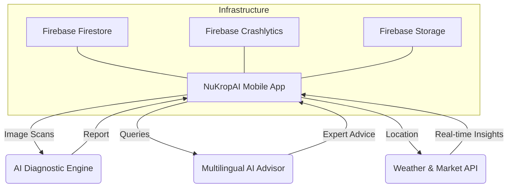

# NuKropAI 🌾🤖 — Production-Ready Agriculture Intelligence

> **Empowering the Hands that Feed the Nation with Elite AI Diagnostics.**

NuKropAI is a comprehensive agricultural intelligence platform engineered for the unique challenges of the Indian rural landscape. It bridges the gap between state-of-the-art AI diagnostics and ground-level farming operations.

---

## 🏗️ Platform Architecture

NuKropAI is built on a modular, high-performance monorepo designed for scale and reliability.

### Ecosystem Overview


### Directory Structure
| Path | Component | Purpose |
| :--- | :--- | :--- |
| `📂 artifacts/mobile` | **Frontend** | React Native (Expo) app with premium UI & animations. |
| `📂 artifacts/api-server` | **Backend** | High-performance Express server for AI & Weather. |
| `📂 lib/` | **Core** | Shared business logic, types, and integration utilities. |
| `📂 scripts/` | **DevOps** | Automation scripts for builds, sync, and deployment. |
| `📂 releases/v1-production/` | **Release** | v1.0 production release notes, changelog & build guide. |

---

## 🚀 Key Capabilities

| Feature | Description | Business Value |
| :--- | :--- | :--- |
| **AI Scanner** | 📸 Instant crop disease diagnosis (>94% accuracy). | Prevent total crop loss. |
| **Voice Advisor** | 💬 Multilingual AI support (English, Hindi, Telugu). | Accessibility for all farmers. |
| **Weather IQ** | ⛅ Predictive alerts based on hyper-local weather. | Optimize pesticide/irrigation usage. |
| **Mandi Intel** | 📊 Real-time market prices & intelligence. | Maximize farmer profitability. |
| **Offline Sync** | 🛡️ Robust data persistence in low-signal areas. | Operational reliability in fields. |

---

## 🛡️ Production Hardening

NuKropAI is engineered for field reliability:
*   **Hardware Aware**: Adaptive image compression for 2GB/3GB RAM devices.
*   **Battery Efficient**: Intelligent background task scheduling (60m window).
*   **Sync Stability**: Timestamp-based conflict resolution for data integrity.
*   **Crash Guard**: Top-level Error Boundary + 5-second splash safety timeout.
*   **Observability**: Full Firebase Crashlytics & Analytics event tracking.

---

## 📦 Deployment

### 📥 Latest Release
Production v1.0 — See [`releases/v1-production/`](releases/v1-production/) for:
- 📄 [Release Notes](releases/v1-production/RELEASE_NOTES.md)
- 📋 [Changelog](releases/v1-production/CHANGELOG.md)
- 🔁 [Build Reproducibility Guide](releases/v1-production/BUILD_REPRODUCIBILITY.md)

### 🛠️ Build Commands
```bash
cd artifacts/mobile

# Preview APK (side-loading / QA testing)
eas build --platform android --profile preview

# Production AAB (Google Play Store)
eas build --platform android --profile production
```

### 🔑 Required EAS Secrets
```
EXPO_PUBLIC_FIREBASE_API_KEY
EXPO_PUBLIC_FIREBASE_AUTH_DOMAIN
EXPO_PUBLIC_FIREBASE_PROJECT_ID
EXPO_PUBLIC_FIREBASE_STORAGE_BUCKET
EXPO_PUBLIC_FIREBASE_MESSAGING_SENDER_ID
EXPO_PUBLIC_FIREBASE_APP_ID
google-services.json  (provisioned via EAS Credentials)
```

---

## 🧪 TypeScript Validation
```bash
cd artifacts/mobile
npx tsc --noEmit   # Exit code: 0 (zero errors)
```

---

*NuKropAI — The future of Indian Agriculture is intelligent.*
