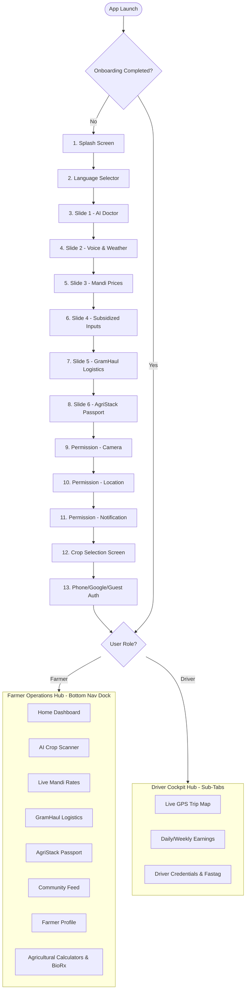

# NuKropAI — Exact Existing Product Line-by-Line Inventory
**Source of Truth Files:**
- `app/src/main/assets/index.html` (16,485 lines, 987,207 characters)
- `nukrop_emulator.html` (Pixel 7 412×915 Mobile Reference)
- `android/app/src/main/java/ai/nukrop/nukrop_app/MainActivity.kt`
- `web/` (Next.js 15 / Supabase Web Showcase & Download Hub)

---

## 1. Executive Summary & Inventory Counts

| Metric Category | Exact Count in Original Source of Truth |
| :--- | :--- |
| **Total Functional Screens & Full Views** | **30** (13 Onboarding/Auth + 17 Main App Views) |
| **Active Sub-Tabs & Inner Views** | **14** (3 Driver Cockpit, 3 Scanner, 3 Community, 2 Chat, 3 Market) |
| **Modals, Dialogs & Bottom Sheets** | **39** functional modal dialogs & bottom sheets |
| **Interactive Form Overlays & Action Sheets** | **19** persistent overlays, toast bars, drawers |
| **Interactive Leaflet OSM Maps** | **2** (GramHaul Logistics 40% Map + Driver Cockpit Real Map) |
| **Charts & Visual Graphs** | **6** (Mandi Historical Price Trends, Soil Health Radar, Farm Khata Balance, Weather Forecast Curve, Driver Weekly Payout, ICAR NPK Ratio) |
| **Native State Presets & Catalogs** | **37** Master In-Memory Catalogs (143 Crops, 120 Master Crops, ICAR NPK, BioRx, Drivers Fleet, etc.) |
| **Realtime Supabase Tables & Channels** | **10** Tables & **4** Realtime Broadcast Channels |
| **Total JavaScript Core Functions** | **293** active functions |
| **Unique LocalStorage State Keys** | **29** persistent offline state variables |

---

## 2. Comprehensive Screen & View Inventory

### A. Startup, Onboarding, Authentication & Permissions Flow (13 Screens)

#### 1. Splash Screen (`splash`)
- **Visual Spec:** Full-screen deep emerald `#064E3B` to obsidian green `#022C22` gradient. Pulsing golden seed / sprout icon in glowing ring (`#86EFAC`).
- **Typography:** Display title `NuKropAI` (32px bold, tracking -0.5px, white) with subtitle `Autonomous Agriculture Operating System` (13px, `#A7F3D0`). Version chip `v2.4 Production Engine`.
- **States:**
  - *Initial:* Pulsing scale transition (`scale(0.95)` to `scale(1.0)`).
  - *Loaded:* Auto-advances after 1.8s or tap-anywhere.
- **Entry Conditions:** App launch / process restart when `nukrop_onboarding_plantix_completed !== 'true'`.
- **Exit Conditions:** Advances to `language` (Language Selection) or directly to `home` if already authenticated.

#### 2. Language Selection Screen (`language`)
- **Visual Spec:** Clean off-white background (`#F8FAFC`). Top banner with tricolor India accent.
- **Header:** `మీ భాషను ఎంచుకోండి / अपनी भाषा चुनें / Choose Language` (20px bold `#0F172A`).
- **Grid:** 11 Indian Languages cards (Telugu, Hindi, English, Tamil, Kannada, Malayalam, Marathi, Bengali, Gujarati, Punjabi, Odia).
- **Cards:** White squircle cards (`#FFFFFF`, border 1.5px `#E2E8F0`, border-radius 16px). Native script title (18px bold) + English sub (12px `#64748B`). Selection active state: emerald border `#059669`, background `#ECFDF5`, checkmark badge.
- **Primary CTA:** Sticky bottom button `కొనసాగించండి → / Continue →` (52px height, `#064E3B`, white text, 16px bold, 16px radius).
- **Entry:** From Splash or in-app settings modal.
- **Exit:** Sets `plantixFlowState.selectedLang` & `currentLang`, advances to `slide_disease`.

#### 3. Onboarding Slide 1 — AI Crop Doctor (`slide_disease`)
- **Visual Spec:** 55% height high-fidelity photography card (`images/onboard_crop_doctor.jpg`) with subtle dark gradient overlay.
- **Top Badge:** `🌿 NuKropAI OS` glass pill (`rgba(0,0,0,0.4)` with 12px blur).
- **Category Badge:** `🌾 AI పంట డాక్టర్` (`#064E3B` text on `#DCFCE7` pill).
- **Content:** Title `క్షణాల్లో AI ఆకు తెగుళ్ల నిర్ధారణ` (24px bold `#0F172A`), Body `ఆకు ఫోటో తీసి తెగుళ్లు, పురుగులు, పోషక లోపాలను వెంటనే గుర్తించి సరైన మందుల మోతాదు పొందండి.` (14px `#475569`, line-height 1.5).
- **Indicator:** 6 animated pagination dots (active dot expanded pill `#059669`).
- **Controls:** `దాటవేయి` (Skip top-right) and bottom CTA `తదుపరి →` (Next).
- **Exit:** Advances to `slide_tips`.

#### 4. Onboarding Slide 2 — AI Voice & Micro-Climate (`slide_tips`)
- **Visual Spec:** Hero image `images/onboard_ai_voice_weather.jpg`.
- **Category Badge:** `🎙️ AI వాయిస్ & వాతావరణం` (Sky blue tint `#E0F2FE`, text `#0369A1`).
- **Content:** Title `మీ గొంతుతోనే వ్యవసాయ సలహాలు`, Sub `మీ స్వంత భాషలో మాట్లాడి విత్తనాలు, మందుల పిచికారీ, మరియు 7 రోజుల వర్ష సూచనలు తెలుసుకోండి.`.
- **Exit:** Advances to `slide_mandi`.

#### 5. Onboarding Slide 3 — Mandi Market Intelligence (`slide_mandi`)
- **Visual Spec:** Hero image `images/onboard_mandi_prices.jpg`.
- **Category Badge:** `📊 మార్కెట్ ధరలు & అంచనాలు` (Amber tint `#FEF3C7`, text `#B45309`).
- **Content:** Title `లైవ్ మార్కెట్ ధరలు & లాభాల అంచనా`, Sub `దేశవ్యాప్త మార్కెట్ల నుండి ప్రత్యక్ష పంట ధరలు, ధరల పెరుగుదల సూచనలు, మరియు గరిష్ట లాభం కోసం మార్కెట్ సిఫార్సులు.`.
- **Exit:** Advances to `slide_deals`.

#### 6. Onboarding Slide 4 — Subsidized Inputs & Agronomy Deals (`slide_deals`)
- **Visual Spec:** Hero image `images/onboard_agri_store.jpg`.
- **Category Badge:** `🛒 రాయితీ ఎరువులు & విత్తనాలు` (Emerald tint `#DCFCE7`, text `#047857`).
- **Content:** Title `రాయితీ ఎరువులు & నాణ్యమైన విత్తనాలు`, Sub `ప్రభుత్వ గుర్తింపు పొందిన డీలర్ల నుండి రాయితీ ధరలకే నాణ్యమైన ఎరువులు, క్రిమిసంహారకాలు మరియు ధృవీకరించిన విత్తనాలు పొందండి.`.
- **Exit:** Advances to `slide_haul`.

#### 7. Onboarding Slide 5 — GramHaul Pooled Farm Logistics (`slide_haul`)
- **Visual Spec:** Hero image `images/onboard_gramhaul_truck.jpg`.
- **Category Badge:** `🚚 గ్రామ్‌హాల్ - ఉమ్మడి రవాణా` (Orange tint `#FFEDD5`, text `#C2410C`).
- **Content:** Title `పొలం నుండే మార్కెట్ రవాణా`, Sub `ఇరుగుపొరుగు రైతులతో కలిసి వాహనాన్ని బుక్ చేసుకోండి. రవాణా ఖర్చుల్లో 40% వరకు ఆదా చేసుకోండి, లైవ్ జీపీఎస్ ద్వారా ట్రాక్ చేయండి.`.
- **Exit:** Advances to `slide_agristack`.

#### 8. Onboarding Slide 6 — AgriStack & Digital Soil Health (`slide_agristack`)
- **Visual Spec:** Hero image `images/onboard_agristack_soil.jpg`.
- **Category Badge:** `🏛️ అగ్రిస్టాక్ & డిజిటల్ పాస్‌పోర్ట్` (Purple tint `#F3E8FF`, text `#7E22CE`).
- **Content:** Title `రైతు డిజిటల్ ఐడెంటిటీ & సాయిల్ కార్డ్`, Sub `మీ భూమి రికార్డులు (RoR), పట్టాదారు పాస్‌బుక్, సాయిల్ హెల్త్ కార్డ్ మరియు KCC బ్యాంకు రుణాలు ఒకే చోట భద్రపరుచుకోండి.`.
- **Exit:** Advances to `perm_camera`.

#### 9. Permission Screen 1/3 — Camera & AI Leaf Scanner (`perm_camera`)
- **Visual Spec:** Glassmorphic modal card with permission illustration/camera badge (64px squircle `#86EFAC` with `#064E3B` lens icon).
- **Progress:** `🔒 అనుమతులు (1/3)` pill chip.
- **Content:** Title `కెమెరా అనుమతి & పంట స్కానర్`, Sub `ఆకు తెగుళ్లు మరియు పురుగులను క్షణాల్లో స్కాన్ చేయడానికి కెమెరా అనుమతి అవసరం. మీ ఫోటోలు పూర్తిగా సురక్షితం.`.
- **Actions:** Primary CTA `కెమెరా అనుమతించండి →` (triggers OS Camera permission dialog via Android bridge), Secondary link `దాటవేయి` (Skip).
- **Exit:** Advances to `perm_location`.

#### 10. Permission Screen 2/3 — Farm Location GPS (`perm_location`)
- **Visual Spec:** Location pin radar illustration (64px squircle `#BFDBFE` with `#1E40AF` GPS icon).
- **Progress:** `🔒 అనుమతులు (2/3)`.
- **Content:** Title `పొలం లొకేషన్ అనుమతి`, Sub `మీ పొలానికి కచ్చితమైన వాతావరణ సూచనలు, సమీప మార్కెట్ ధరలు, మరియు గ్రామ్‌హాల్ డ్రైవర్ పికప్ కోసం GPS లొకేషన్ అవసరం.`.
- **Actions:** Primary CTA `లొకేషన్ అనుమతించండి →` (triggers Android fine location permission), Secondary `దాటవేయి`.
- **Exit:** Advances to `perm_notifications`.

#### 11. Permission Screen 3/3 — Real-Time Alert Notifications (`perm_notifications`)
- **Visual Spec:** Bell alert wave icon (64px squircle `#FED7AA` with `#C2410C` bell).
- **Progress:** `🔒 అనుమతులు (3/3)`.
- **Content:** Title `నోటిఫికేషన్ అనుమతి`, Sub `ఆకస్మిక వర్ష సూచనలు, మిడతలు/పురుగుల ముందస్తు హెచ్చరికలు మరియు మార్కెట్ ధరల హెచ్చుతగ్గుల అలర్ట్స్ అందుకోండి.`.
- **Actions:** Primary CTA `నోటిఫికేషన్లు అనుమతించండి →` (triggers `POST_NOTIFICATIONS`), Secondary `దాటవేయి`.
- **Exit:** Advances to `crops`.

#### 12. Crop Selection Screen (`crops`)
- **Visual Spec:** Clean white screen with search bar `🔍 మీ పంటలను వెతకండి (ఉదా: పత్తి, మిరప)...`.
- **Header:** `మీరు పండించే పంటలను ఎంచుకోండి` (20px bold `#0F172A`) with counter badge `ఎంచుకున్నవి: 3 పంటలు`.
- **Grid:** Responsive 3-column crop cards grid with 143 OpenFarm localized crops (`MASTER_120_CROPS` & `OPENFARM_CROPS_CATALOG`).
- **Card Anatomy:** 80px card, rounded-20px, light green border `#E2E8F0`, high-res crop icon/photo, localized pure Telugu/Hindi name (13px bold), selection checkmark pill.
- **Sticky CTA:** `కొనసాగించండి (3 పంటలు) →` (52px `#064E3B`, white text).
- **Exit:** Advances to `login` or straight to `home` if already logged in.

#### 13. Authentication Screen (`login`)
- **Visual Spec:** Split brand header with Google Auth button, Phone OTP input form, and Guest Mode bypass.
- **Components:**
  - *Brand Lockup:* NuKropAI Logo + `భారతీయ రైతుల కోసం రూపొందించిన సమగ్ర వ్యవసాయ వేదిక`.
  - *Google Sign-In Button:* Authentic Google white pill button with multicolor "G" logo: `Google ఖాతాతో కొనసాగించండి` (triggers `openInAppGoogleAuthModal()`).
  - *Divider:* `లేదా మొబైల్ నంబర్‌తో` (Or with Mobile Number).
  - *Phone Input Card:* `+91` fixed country prefix + 10-digit number field with auto-focus.
  - *OTP Input Card (Stateful):* 6-box OTP entry with resend timer (45s).
  - *Guest Mode Bypass:* `అతిథిగా ప్రవేశించండి (డెమో మోడ్) →` (Explore without logging in).
- **Exit:** Completes onboarding, stores user profile token in `localStorage`, dismisses startup overlay, opens `home`.

---

### B. Farmer Operations Hub Views (17 Main Views)

#### 14. Farmer Home Dashboard (`home`)
- **Top Header Bar:**
  - Active Farm Location Chip: `📍 వరంగల్, ధర్మారం (Sy.No 142/A)`.
  - Active Crop Selector Dropdown: Horizontal scrolling crop pills (`🌱 పత్తి`, `🌶️ మిరప`, `🌾 వరి`, `+ పంటను జోడించండి`).
  - Notification Bell with red unread badge (opens `APP_NOTIFICATIONS`).
- **Live Weather Bento Card:**
  - Current Temp `29°C`, Condition `పాక్షికంగా మేఘావృతం`, Humidity `88%`, Rain Probability `65% (సాయంత్రం జల్లులు)`.
  - Spray Advisory Indicator: `🟢 స్ప్రే చేయడానికి అనుకూలం (సాయంత్రం 4 గంటల తర్వాత)`.
- **Live Mandi Ticker Strip:**
  - Real-time marquee scroll showing `పత్తి ₹7,650/Qtl ▲ +₹150`, `మిర్చి ₹21,200/Qtl ▲ +₹400`, `మొక్కజొన్న ₹2,150/Qtl ▼ -₹25`.
- **AI Advisory Action Card:**
  - `🌿 ఆకు తెగుళ్ల స్కానర్` quick launcher card with camera viewfinder icon.
  - Micro-action buttons: `వాయిస్ అసిస్టెంట్`, `సాయిల్ హెల్త్`, `ఎరువుల లెక్క`.
- **Regional Pest Surveillance Alert Banner (BioShield Live):**
  - Urgent warning card for Pink Bollworm (గులాబీ పురుగు) in Warangal district with photo, distance `3.8 km away`, and instant ICAR spray recipe button.
- **Market Price Card:**
  - Closest APMC Mandi rates (Enamamula Mandi) with trend sparkline and `అమ్మకానికి రవాణా బుక్ చేయండి` CTA.

#### 15. AI Crop Scanner & Diagnostic Viewfinder (`scanner`)
- **Viewfinder Container:** 100% full-screen live video stream (`<video autoplay playsinline>`) with simulated laser scan animation grid overlay.
- **Controls Toolbar:**
  - Flash Toggle (`⚡ ఫ్లాష్`).
  - Multi-leaf / Single-leaf toggle.
  - Gallery upload file picker (`🖼️ గ్యాలరీ నుండి`).
- **History Drawer:** Slide-up bottom sheet showing saved diagnostic scans (`nukrop_saved_scans`) with crop thumbnail, date, detected disease, and severity percentage.
- **Diagnostic Result Card (Post-Capture):**
  - Disease Name (e.g., `గులాబీ రంగు కాయ తొలిచే పురుగు / Pink Bollworm`).
  - Confidence Score (e.g., `96.4% కచ్చితత్వం`).
  - Symptoms Breakdown (visual bullet points).
  - Treatment Tabs:
    - *సేంద్రీయ నివారణ (Organic BioRx):* Neemastra / Agniastra preparation.
    - *రసాయన నివారణ (ICAR Chemical):* Profenofos 50% EC @ 350ml/acre.
  - Audio Pronunciation Button (synthesizes Telugu voice treatment via Web Speech API).
  - Save to Farm Health Record (`💾 ప్రిస్క్రిప్షన్ సేవ్ చేయండి`).

#### 16. Live Mandi Rates & Market Intelligence (`market`)
- **Header:** `లైవ్ మార్కెట్ ధరలు` with direct Agmarknet Govt API sync status chip `🟢 లైవ్ సింక్`.
- **Filter Row:**
  - State Dropdown (Telangana, Andhra Pradesh, Maharashtra, Karnataka, Punjab, etc.).
  - District / Mandi Dropdown (Warangal, Guntur, Khammam, Nizamabad, Suryapet, etc.).
  - Crop Search Bar with autocomplete.
- **Popular Crops Pill Strip:** Quick toggles for `టమోటా`, `గోధుమ`, `ఉల్లిపాయ`, `పత్తి`, `బంగాళాదుంప`, `మిర్చి`.
- **Mandi Price Cards List:**
  - Commodity name, Grade (FAQ/Special), Min Price, Modal Price, Max Price per Quintal.
  - Comparison vs MSP 2026: Green `+₹450 MSP కన్నా ఎక్కువ` or Red badge.
  - Action Buttons on each card:
    - `📊 ధరల ట్రెండ్` (opens `openPriceTrendModal()`).
    - `🔔 ధర అలర్ట్` (opens `openPriceAlertModal()`).
    - `🚚 రవాణా బుక్ చేయండి` (opens GramHaul booking sheet with prefilled crop and destination mandi).

#### 17. GramHaul Pooled Farm Logistics (`gramhaul`)
- **Interactive Map Section (40% Viewport Height):**
  - Leaflet OSM Map centered at farmer GPS (`17.9689, 79.5941` Warangal).
  - Custom truck icons moving in real-time with telemetry radar rings.
  - Farmer farm pin marker (`📍 మీ పొలం`).
  - Mandi destination pin marker (`🏢 వరంగల్ ఎనామాముల మార్కెట్`).
  - Connecting dotted haul route polyline with ETA `24 నిమిషాలు`.
- **Haul Booking Bottom Sheet:**
  - *పికప్ లొకేషన్:* Farm address with survey number edit button.
  - *గమ్యస్థాన మార్కెట్:* Selected APMC mandi dropdown.
  - *పంట రకం:* Active crop selector.
  - *బస్తాల సంఖ్య:* Increment/Decrement stepper (`[-] 10 బస్తాలు [+]` ~ 5.0 క్వింటాళ్లు).
  - *రవాణా వాహనాన్ని ఎంచుకోండి:*
    - Auto / Mini 3-Wheeler (500 kg / 10 బస్తాలు) — `₹350`.
    - Tata Ace Gold 1.5T (1,500 kg / 30 బస్తాలు) — `₹750`.
    - Bolero Pickup 2.5T (2,500 kg / 50 బస్తాలు) — `₹1,200`.
    - Eicher 14ft Canter (5,000 kg / 100 బస్తాలు) — `₹2,200`.
  - *షేరింగ్ పొదుపు బ్యాడ్జ్:* `⚡ ఉమ్మడి రవాణా ద్వారా ₹450 ఆదా అవుతుంది`.
  - *ప్రైమరీ CTA:* `ట్రక్కును బుక్ చేయండి →` (triggers `executeRealGramhaulDispatch()`).

#### 18. AgriStack & Digital Land Records (`agristack`)
- **Digital Farmer Passport Card:**
  - Gold & Emerald Guilloche patterned security card.
  - Farmer Name, AgriStack Farmer ID `TS-WGL-8941`, Aadhaar KYC Verified chip `🟢 e-KYC ధృవీకరించబడింది`.
  - Digital QR Code containing signed JSON credentials.
- **Landholding Ledger:**
  - Survey No `142/A`, Village `ధర్మారం`, Mandal `గీసుకొండ`, District `వరంగల్`.
  - Extent: `2.50 ఎకరాలు`, Land Type: `పట్టా భూమి (సాగు భూమి)`.
  - Pattadar Passbook T-14020199482.
- **Action Buttons:**
  - `📄 RoR-1B డిజిటల్ పత్రం డౌన్‌లోడ్`.
  - `🔍 సర్వే నంబర్ శోధించండి` (opens `openSearchLandSurveyModal()`).
  - `⚠️ సరిహద్దు అభ్యంతరం నమోదు` (opens `openAgriStackObjectionModal()`).
  - `🏦 తక్షణ KCC రుణ దరఖాస్తు` (opens `openAgriStackLoanApplyModal()`).

#### 19. Custom Hiring Centers Farm Machinery Rental (`equipment`)
- **Category Filter Tabs:** `అన్నీ`, `ట్రాక్టర్లు`, `హార్వెస్టర్లు`, `రోటవేటర్లు`, `స్ప్రేయింగ్ డ్రోన్లు`.
- **Machinery Listing Cards:**
  - Machine photo, Model (e.g. `Mahindra 575 DI Tractor 45HP`).
  - CHC Center Name, Distance `4.2 కి.మీ దూరం`.
  - Rate: `₹850 / గంట` (డీజిల్ & ఆపరేటర్‌తో సహా).
  - Availability Badge: `🟢 అందుబాటులో ఉంది (రేపు ఉదయం)`.
  - Action CTA: `యంత్రాన్ని బుక్ చేయండి` (opens `openMachineryBookingModal()`).
- **Owner Floating Action Button:** `+ మీ యంత్రాన్ని అద్దెకు ఇవ్వండి` (opens `openMachineryListingModal()`).

#### 20. Kisan Credit Card (KCC) & Digital Agri Loans (`loan`)
- **Sanctioned Limit Card:** `₹1,25,000` (మంజూరైన పరిమితి), Available `₹85,000`, 4% Prompt Repayment Subvention APR.
- **Active Loan Breakdown:** Kharif Crop Loan (Cotton) due March 31, 2027.
- **Government Schemes Integration:**
  - PM Kisan Samman Nidhi: 17th Installment `₹2,000 క్రెడిట్ అయింది`.
  - PMFBY Crop Insurance: Policy No `PMFBY-2026-TL-841` Active.
- **Actions:**
  - `💸 తక్షణ డ్రా చేయండి (Disburse to Bank)`.
  - `📈 పరిమితి పెంపు దరఖాస్తు (Enhance Limit)`.

#### 21. Farm Khata Digital Accounting Ledger (`khata`)
- **Balance Card:**
  - Total Income: `₹1,84,500` (ఆదాయం).
  - Total Expense: `₹62,300` (ఖర్చులు).
  - Net Profit: `₹1,22,200` (నికర లాభం).
- **Recent Transaction Entries List:**
  - Visual category icon (Fertilizer, Diesel, Labor, Seeds, Mandi Harvest Sale).
  - Amount, Date, Voucher image thumbnail.
- **Floating Button:** `+ కొత్త ఎంట్రీ జోడించండి` (opens `openKhataEntryModal()`).
- **Export Action:** `📊 PDF బ్యాలెన్స్ షీట్ డౌన్‌లోడ్`.

#### 22. AI Agro-Doctor Consultation Chat (`chat`)
- **Header:** `AI అగ్రో-డాక్టర్ (24/7 శాస్త్రవేత్త సలహా)` with active model indicator `Gemini 3.8 Flash Ag-Engine`.
- **Audio Voice Mode:** Live speech-to-text input button + audio speaker playback.
- **Chat Thread:**
  - User messages (voice or text).
  - AI responses formatted with markdown, dosage recommendations, spray timings, and photo attachments.
- **Quick Suggested Prompts:** `పత్తిలో ఆకుముడత నివారణ ఏమిటి?`, `ఎకరాకు యూరియా ఎంత వేయాలి?`, `వర్షం ఎప్పుడు పడుతుంది?`.

#### 23. BioShield Pest Surveillance Radar (`bioshield`)
- **Regional Trap Density Map:** Live pheromone trap alerts across Telangana and AP.
- **Active Pest Cards:**
  - Pink Bollworm (Warangal, Nalgonda, Khammam).
  - Fall Armyworm (Karimnagar, Nizamabad).
  - Chilli Black Thrips (Guntur, Warangal).
- **Meteorological Vector Warning:** Relative humidity (88%) + 29°C temperature accelerating egg hatching.
- **Economic Threshold Warning (ETL):** `>8 moths/trap for 3 consecutive nights`.

#### 24. Indigenous Organic Bio-Formulations Catalog (`biorx`)
- **Header:** `దేశీ సేంద్రీయ ఔషధాలు (సుభాష్ పాలేకర్ ప్రకృతి వ్యవసాయ పద్ధతులు)`.
- **Formulation Cards:**
  - జీవామృతం (Jeevamrit) — Soil probiotic.
  - నీమాస్త్రం (Neemastra) — Botanical shield for sucking pests.
  - బ్రహ్మాస్త్రం (Brahmastra) — Caterpillar & borer control.
  - అగ్నియాస్త్రం (Agniastra) — Severe pest outbreak shield.
  - దశపర్ణి కషాయం (Dashaparni Kashayam) — Broad-spectrum protector.
- **Card Action:** Tap card opens `openBioRxRecipeModal()` with ingredients list, preparation steps, dosage, and step-by-step voice guidance.

#### 25. Precision NPK Fertilizer Calculator (`calc_fert`)
- **Inputs:** Crop selector (Cotton, Paddy, Chilli, Maize, etc.), Land acreage (Acres / Guntas), Soil test values (N, P, K levels or standard default).
- **Output Result Card:**
  - Urea required (bags / kg).
  - DAP required (bags / kg).
  - MOP (Potash) required (bags / kg).
  - Basal vs Top-dressing split schedule across 3 crop growth stages (Sowing, 30 DAS, 60 DAS).

#### 26. Pesticide & Spray Volume Calculator (`calc_pest`)
- **Inputs:** Pest type, Selected chemical / bio-pesticide, Pump tank capacity (15L knapsack vs 20L vs 500L tractor sprayer), Number of pumps per acre.
- **Output:** Exact dosage in ml or grams per pump, safety PPE checklist, and waiting period before harvest.

#### 27. Crop Budget & Cost-of-Cultivation Estimator (`calc_budget`)
- **Inputs:** Crop type, Target yield (Quintals/Acre), Expected Mandi sale price.
- **Output:** Comprehensive itemized breakdown:
  - Land preparation & plowing cost.
  - Seeds & nursery cost.
  - Fertilizer & manure cost.
  - Irrigation & electricity cost.
  - Weeding & labor cost.
  - Harvesting & transport cost.
  - Projected Net ROI & Break-even price.

#### 28. Plantix / Krishi Community Feed (`community`)
- **Category Filter Strip:** `అన్ని అంశాలు`, `పత్తి`, `మిరప`, `వరి`, `టమోటా`, `యంత్రాలు`.
- **Post Composer Card:** `మీ ప్రశ్న లేదా పంట ఫోటోను ఇక్కడ పోస్ట్ చేయండి...` (opens `openAskQuestionModal()`).
- **Community Posts List:**
  - Farmer avatar, name, village, time ago.
  - High-res leaf photo / crop issue.
  - Question text in regional script.
  - Upvote / Like counter (realtime Supabase sync).
  - Reply thread with verified Agronomist badge responses.

#### 29. GramHaul Driver Cockpit (`driver_dashboard`)
- **Top Duty Bar:** Online/Offline switch button (`🟢 Duty ON` / `🔴 Duty OFF`), vehicle number `TS 03 UB 4491`, vehicle type `Tata Ace Gold 1.5T`.
- **Sub-Tabs Dock:**
  - `మ్యాప్ (Map):` Active trip Leaflet map, pickup farm pin, drop mandi pin, live navigation button, active haul request sheet with farmer name, crop, bags, fare `₹1,850`, `అంగీకరించు (Accept)` & `తిరస్కరించు (Decline)`.
  - `ఆదాయం (Earnings):` Today's payout `₹2,450`, Weekly total `₹14,200`, completed trip cards list with UPI settlement button.
  - `ప్రొఫైల్ (Profile):` Driver photo, rating `★4.9`, completed trips `145 ట్రిప్పులు`, Acceptance rate `98%`, commercial RC docs, FASTag & Insurance modal launcher, and red `లాగ్ అవుట్ (Log Out)` button.

#### 30. Farmer Profile & Settings (`profile`)
- **Hero Card:** Emerald green background with user avatar `R`, Name `బి. జస్వంత్ రెడ్డి`, Farmer ID `ID: FR-2026-9874512`, Village `📍 ధర్మారం, గీసుకొండ, వరంగల్`.
- **Stat Badges:**
  - `2.5 ఎకరాలు` (Landholding).
  - `850` (Soil Health Score).
  - `A+` (AgriStack Farmer Grade).
- **Navigation Action Menu:**
  - `అగ్రిస్టాక్ గుర్తింపు (AgriStack Identity)` — TS-WGL-8941 · Verified.
  - `KCC రుణ స్థితి (KCC Loan Status)` — Sanctioned: ₹1.25L.
  - `పొలం పత్రాలు (Farm Documents)` — RoR, Pattadar Passbook.
  - `సెట్టింగ్స్ & భాష (Settings)` — App preferences & language picker.
  - `సహాయం & మద్దతు (Help & Support)` — 24/7 agriculture helpline.
- **Log Out Button:** Prominent red button `[→] లాగ్ అవుట్` (clears auth session and redirects to splash/login cleanly).

---

## 3. Complete Modal & Bottom Sheet Inventory (39 Modals)

1. `truck-booking-modal` — Farmer pooled truck booking sheet (Bags counter, vehicle type, price calculation, savings vs solo rate).
2. `biorx-recipe-modal` — Organic BioRx recipe details (Ingredients, preparation protocol, dosage, voice synthesis).
3. `crop-modal` / `crop-modal-grid` — Bottom sheet to change active crop on dashboard.
4. `spray-modal` / `spraying-modal` — Spraying conditions and wind speed advisory sheet.
5. `price-trend-modal` — Historical mandi price graph and 7-day price forecast.
6. `price-alert-modal` — SMS/WhatsApp/Push target price threshold setup.
7. `community-ask-modal` — New community post creation form with camera photo upload.
8. `profile-edit-modal` — Farmer profile editor (name, village, land extent, phone).
9. `privacy-policy-modal` — Digital Personal Data Protection Act compliance document.
10. `terms-service-modal` — Terms of Service and MSP advisory disclaimer.
11. `soil-health-modal` — 12-parameter soil health card scorecard and micronutrient deficit analysis.
12. `machinery-booking-modal` — Farm equipment reservation form (Date, hours, land location).
13. `machinery-listing-modal` — Machine owner listing form (Make, model, hourly rate, phone).
14. `khata-entry-modal` — Digital ledger transaction entry sheet (Income/Expense, category, amount, photo receipt).
15. `all-india-lang-modal` / `language-selector-modal` — In-app language switcher modal with 11 Indian languages.
16. `google-auth-modal` — Native Google Account chooser modal with avatar, email, and one-tap sign-in.
17. `driver-insurance-modal` / `openDriverInsuranceFastagModal` — Driver commercial vehicle insurance, policy number, FASTag balance, and expiry dates.
18. `agristack-identity-modal` — Farmer National AgriStack ID card modal with QR code.
19. `agristack-objection-modal` — Boundary dispute / survey objection submission sheet.
20. `agristack-loan-modal` — Instant bank loan pre-approval sheet linked to verified land records.
21. `land-survey-search-modal` — Land survey number search across Telangana Dharani & AP Meebhoomi.
22. `driver-add-truck-modal` — Driver registration modal to onboard a new transport vehicle.
23. `driver-call-modal` — Direct contact sheet with Call and WhatsApp buttons for assigned driver.
24. `driver-haul-history-modal` — Driver completed trip logs with date, farmer, distance, fare.
25. `driver-fastag-modal` — FASTag balance recharge and toll passage history.
26. `driver-vehicle-docs-modal` — Digital vault for RC, Driving License, Fitness Certificate, PUC.
27. `kcc-disbursal-modal` — Instant loan withdrawal to linked Aadhaar bank account.
28. `kcc-enhance-modal` — Application to expand credit limit for upcoming agricultural season.
29. `farm-docs-modal` — Digital safe storing Pattadar Passbook, RoR-1B, and Soil Health Card.
30. `saved-prescriptions-modal` — Archive of previous AI disease diagnostic scans and treatment outcomes.
31. `kisan-helpline-modal` — One-tap dialer for Kisan Call Centre (1800-180-1551) and district agronomists.
32. `support-modal` — In-app customer support, WhatsApp ticket submission, and FAQ guide.
33. `refer-earn-modal` — Peer farmer referral system (deprecated/hidden per recent user requests).
34. `gramhaul-booking-modal` — Full-page farm logistics order confirmation sheet.
35. `gh-dispatched-modal` — Live driver matching broadcast sheet with pulsing radar animation and 60s countdown.
36. `gh-dispatch-loading-modal` — Matching server standby animation.
37. `global-push-toast` — Floating Android system-style notification banner with dismiss action.
38. `startup-experience-overlay` — Full-screen root container hosting splash, onboarding, permissions, and crop picker.
39. `onboarding-experience-overlay` — Secondary onboarding wrapper.

---

## 4. Navigation Architecture & Route Extraction

### A. Navigation Flow Diagram



### B. Route Table Mapping

| Route Key | Screen Component | Entry Conditions | Exit Conditions | Target Flutter Route |
| :--- | :--- | :--- | :--- | :--- |
| `splash` | `renderSplashScreen` | App starts | Timer (1.8s) or Tap | `/splash` |
| `language` | `renderPlantixLanguageScreen` | After splash | User selects language | `/language` |
| `slide_disease` | `renderCarouselSlide` | From language | Next or Skip | `/onboarding/disease` |
| `slide_tips` | `renderCarouselSlide` | From slide 1 | Next, Prev, or Skip | `/onboarding/tips` |
| `slide_mandi` | `renderCarouselSlide` | From slide 2 | Next, Prev, or Skip | `/onboarding/mandi` |
| `slide_deals` | `renderCarouselSlide` | From slide 3 | Next, Prev, or Skip | `/onboarding/deals` |
| `slide_haul` | `renderCarouselSlide` | From slide 4 | Next, Prev, or Skip | `/onboarding/haul` |
| `slide_agristack` | `renderCarouselSlide` | From slide 5 | Next, Prev, or Skip | `/onboarding/agristack` |
| `perm_camera` | `renderCameraPermissionScreen` | From slide 6 | Grant or Skip | `/permissions/camera` |
| `perm_location` | `renderLocationPermissionScreen` | From perm 1 | Grant or Skip | `/permissions/location` |
| `perm_notifications` | `renderNotificationPermissionScreen` | From perm 2 | Grant or Skip | `/permissions/notifications` |
| `crops` | `renderPlantixCropsScreen` | After perms | Min 1 crop selected & CTA | `/crops/selection` |
| `login` | `renderLoginScreen` | After crops / re-auth | Phone OTP, Google, or Guest | `/auth/login` |
| `home` | `APP_VIEWS.home` | Default farmer landing | Tab tap or tool launch | `/farmer/home` |
| `scanner` | `APP_VIEWS.scanner` | Center FAB or tool tile | Close or Save result | `/farmer/scanner` |
| `market` | `APP_VIEWS.market` | Bottom tab 4 or quick tile | Back or Haul dispatch | `/farmer/mandi` |
| `gramhaul` | `APP_VIEWS.gramhaul` | Floating pill or booking | Dispatch or Cancel | `/farmer/gramhaul` |
| `agristack` | `APP_VIEWS.agristack` | Profile or menu item | Back or View doc | `/farmer/agristack` |
| `equipment` | `APP_VIEWS.equipment` | Tool grid tile | Back or Book machine | `/farmer/equipment` |
| `loan` | `APP_VIEWS.loan` | Profile or KCC card | Back or Apply | `/farmer/loan` |
| `khata` | `APP_VIEWS.khata` | Tool grid tile | Back or Add entry | `/farmer/khata` |
| `chat` | `APP_VIEWS.chat` | Voice button or tool tile | Back | `/farmer/chat` |
| `bioshield` | `APP_VIEWS.bioshield` | Alert card tap | Back or Spray recipe | `/farmer/bioshield` |
| `biorx` | `APP_VIEWS.biorx` | Tool grid tile | Back or Open recipe | `/farmer/biorx` |
| `calc_fert` | `APP_VIEWS.calc_fert` | Tool grid tile | Back or Recalculate | `/farmer/calc-fert` |
| `calc_pest` | `APP_VIEWS.calc_pest` | Tool grid tile | Back or Recalculate | `/farmer/calc-pest` |
| `calc_budget` | `APP_VIEWS.calc_budget` | Tool grid tile | Back or Recalculate | `/farmer/calc-budget` |
| `community` | `APP_VIEWS.community` | Bottom tab 2 | Back or Post question | `/farmer/community` |
| `driver_dashboard` | `APP_VIEWS.driver_dashboard` | Logged in as Driver | Driver logout or switch | `/driver/cockpit` |
| `profile` | `APP_VIEWS.profile` | Bottom tab 5 | Edit or Logout | `/farmer/profile` |

---

## 5. Master Data Catalogs & State Machine Inventory

1. `MASTER_120_CROPS` & `OPENFARM_CROPS_CATALOG` — 143 crops with botanical names, slug, and multi-language translations.
2. `I18N` — Complete UI localization tables for 11 Indian languages.
3. `ONBOARDING_I18N` — Dedicated onboarding and permissions translation dictionaries.
4. `MANDI_TRUCKS_CATALOG` & `REAL_DRIVERS_FLEET` — Active rural logistics fleet with vehicle models, capacities, rates per quintal, ratings, and locations.
5. `PEST_SURVEILLANCE_ALERTS` — ICAR regional pest trap outbreak records with meteorological vectors and economic injury levels (ETL).
6. `BIORX_RECIPES_CATALOG` — Formulations for Jeevamrit, Neemastra, Brahmastra, Agniastra, Dashaparni Kashayam with exact ingredients, preparation, and audio instructions.
7. `AGMARKNET_MANDI_CATALOG` & `REAL_APMC_MANDIS` — Nationwide APMC markets data with modal prices, minimums, maximums, and daily trends.
8. `COMMUNITY_POSTS_CATALOG` — Initial community discussion threads, upvotes, agronomist answers.
9. `FARM_MACHINERY_CATALOG` — Custom Hiring Centers equipment inventory (tractors, harvesters, rotavators, spray drones).
10. `GOVT_SCHEMES_CATALOG` — PM Kisan, PMFBY, Rythu Bandhu, KCC guidelines.
11. `CROP_ICAR_NPK_PRESETS` — ICAR targeted nutrient standards for field crops.
12. `MSP_2026` — Minimum Support Price statutory rates for 2026-27 crop season.

---

## 6. Exact Design System Tokens

```css
/* Core Palette */
--r-primary-dark: #064E3B;    /* Deep Forest Green - Primary App Bar & Badges */
--r-primary:      #059669;    /* Emerald Green - Active Buttons & Toggles */
--r-primary-light:#10B981;    /* Bright Jade */
--r-accent:       #86EFAC;    /* Vibrant Mint Accent - Avatars & Highlighting */
--r-surface-tint: #ECFDF5;    /* Soft Mint Tint - Active Card Background */

/* Driver Cockpit Palette */
--r-dark:         #0F172A;    /* Obsidian Charcoal - Driver Background */
--r-yellow:       #FBBF24;    /* Safety Amber - Driver Badges & Telemetry */
--r-gold:         #F59E0B;    /* Goldenrod - Driver Accents */

/* Neutral & Background */
--r-bg:           #F8FAFC;    /* Ultra-clean Slate White */
--r-card:         #FFFFFF;    /* Pure White Surface */
--r-border:       #E2E8F0;    /* Light Slate Border */
--r-text-main:    #0F172A;    /* Slate 900 - High Contrast Headlines */
--r-text-sub:     #475569;    /* Slate 600 - Secondary Descriptions */
--r-text-muted:   #94A3B8;    /* Slate 400 - Timestamps & Footers */

/* Alert & Safety */
--r-danger:       #DC2626;    /* Crimson Red - Log Out & Critical Pest Alerts */
--r-danger-bg:    #FEF2F2;    /* Soft Pink Red Tint */
--r-warning:      #EA580C;    /* Tangerine - Moderate Risk Alert */
--r-warning-bg:   #FFF7ED;    /* Warm Amber Tint */

/* Geometry & Radii */
--radius-card:    20px;
--radius-squircle:16px;
--radius-btn:     14px;
--radius-pill:    9999px;
--radius-modal:   28px;
```
