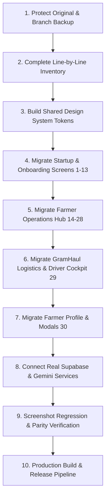

# NuKropAI — Exact UI Recovery & Architecture Report

**Status:** STOP & RECOVER APPLIED. Original Application Secured & Verified as Source of Truth.  
**Reference Implementations:**
- `app/src/main/assets/index.html` (16,485 lines)
- `nukrop_emulator.html` (Pixel 7 412×915 Mobile Reference)
- `android/app/src/main/java/ai/nukrop/nukrop_app/MainActivity.kt`
- `web/` (Next.js 15 Web Hub & Release Distribution)

---

## 1. Original Screen Count
**Total: 30 Fully Implemented Screens & Core Views**
- **13 Startup, Onboarding, Authentication & Permission Screens:**
  1. Splash Screen (`splash`)
  2. Language Selection Screen (`language` — 11 Indian Languages)
  3. Onboarding Slide 1: AI Crop Doctor (`slide_disease`)
  4. Onboarding Slide 2: AI Voice & Weather (`slide_tips`)
  5. Onboarding Slide 3: Mandi Market Intelligence (`slide_mandi`)
  6. Onboarding Slide 4: Subsidized Inputs & Agronomy Deals (`slide_deals`)
  7. Onboarding Slide 5: GramHaul Pooled Farm Logistics (`slide_haul`)
  8. Onboarding Slide 6: AgriStack & Digital Soil Health (`slide_agristack`)
  9. Permissions 1/3: AI Crop Scanner Camera (`perm_camera`)
  10. Permissions 2/3: Farm GPS Location (`perm_location`)
  11. Permissions 3/3: Real-Time Alerts Notification (`perm_notifications`)
  12. Crop Selection Screen (`crops` — 143 OpenFarm localized crops)
  13. Authentication Screen (`login` — Google Auth, Phone OTP, Guest Bypass)
- **17 Main App Operations Views (`APP_VIEWS`):**
  14. Farmer Home Dashboard (`home`)
  15. AI Crop Scanner & Diagnostic Viewfinder (`scanner`)
  16. Live Mandi Rates & Agmarknet Intelligence (`market`)
  17. GramHaul Pooled Farm Logistics with 40% Leaflet OSM Map (`gramhaul`)
  18. AgriStack & Digital Land Records (`agristack`)
  19. Custom Hiring Centers Farm Machinery Rental (`equipment`)
  20. Kisan Credit Card (KCC) & Digital Agri Loans (`loan`)
  21. Farm Khata Digital Accounting Ledger (`khata`)
  22. AI Agro-Doctor Consultation Chat (`chat`)
  23. BioShield Autonomous Pest Surveillance Radar (`bioshield`)
  24. Indigenous Organic Bio-Formulations Catalog (`biorx`)
  25. Precision NPK Fertilizer Calculator (`calc_fert`)
  26. Pesticide & Spray Volume Calculator (`calc_pest`)
  27. Crop Budget & Cost-of-Cultivation Estimator (`calc_budget`)
  28. Plantix / Krishi Community Feed (`community`)
  29. GramHaul Driver Cockpit (`driver_dashboard`)
  30. Farmer Profile & Settings (`profile`)

---

## 2. Original Route Count
**Total: 30 Named Navigation Routes**
- `/splash`
- `/language`
- `/onboarding/disease`
- `/onboarding/tips`
- `/onboarding/mandi`
- `/onboarding/deals`
- `/onboarding/haul`
- `/onboarding/agristack`
- `/permissions/camera`
- `/permissions/location`
- `/permissions/notifications`
- `/crops/selection`
- `/auth/login`
- `/farmer/home`
- `/farmer/scanner`
- `/farmer/mandi`
- `/farmer/gramhaul`
- `/farmer/agristack`
- `/farmer/equipment`
- `/farmer/loan`
- `/farmer/khata`
- `/farmer/chat`
- `/farmer/bioshield`
- `/farmer/biorx`
- `/farmer/calc-fert`
- `/farmer/calc-pest`
- `/farmer/calc-budget`
- `/farmer/community`
- `/driver/cockpit`
- `/farmer/profile`

---

## 3. Original Modal & Bottom Sheet Count
**Total: 39 Functional Modals, Bottom Sheets & Action Overlays**
1. `truck-booking-modal` (Pooled truck booking sheet with bag counter)
2. `biorx-recipe-modal` (Indigenous recipe instructions with voice audio)
3. `crop-modal` / `crop-modal-grid` (Active crop switcher modal)
4. `spray-modal` / `spraying-modal` (Spraying conditions & wind advisory)
5. `price-trend-modal` (7-day / 30-day historical Mandi price trend graph)
6. `price-alert-modal` (Target price SMS/WhatsApp alert threshold setup)
7. `community-ask-modal` (Post question with leaf photo upload)
8. `profile-edit-modal` (Farmer profile details editor)
9. `privacy-policy-modal` (DPDPA digital privacy compliance modal)
10. `terms-service-modal` (Terms of service & MSP advisory disclaimer)
11. `soil-health-modal` (12-parameter soil health scorecard)
12. `machinery-booking-modal` (CHC tractor & drone booking sheet)
13. `machinery-listing-modal` (Equipment owner rent listing form)
14. `khata-entry-modal` (Income/Expense ledger entry modal)
15. `all-india-lang-modal` / `language-selector-modal` (In-app language switcher)
16. `google-auth-modal` (Native Google account chooser sheet)
17. `driver-insurance-modal` (Driver insurance policy & FASTag toll modal)
18. `agristack-identity-modal` (Digital farmer passport modal with QR)
19. `agristack-objection-modal` (Land survey boundary dispute form)
20. `agristack-loan-modal` (Pre-approved bank loan application)
21. `land-survey-search-modal` (Dharani/Meebhoomi land survey search)
22. `driver-add-truck-modal` (Driver vehicle onboarding form)
23. `driver-call-modal` (Driver contact dialer / WhatsApp modal)
24. `driver-haul-history-modal` (Driver completed trips and earnings)
25. `driver-fastag-modal` (FASTag balance recharge modal)
26. `driver-vehicle-docs-modal` (RC, Fitness, Commercial permit safe)
27. `kcc-disbursal-modal` (Instant loan withdrawal sheet)
28. `kcc-enhance-modal` (Credit limit enhancement request)
29. `farm-docs-modal` (Pattadar passbook & digital vault)
30. `saved-prescriptions-modal` (AI diagnostic reports archive)
31. `kisan-helpline-modal` (Kisan Call Centre 1800-180-1551 dialer)
32. `support-modal` (24/7 Krishi Helpline & WhatsApp ticket)
33. `refer-earn-modal` (Referral modal)
34. `gramhaul-booking-modal` (Full logistics confirmation sheet)
35. `gh-dispatched-modal` (Live driver matching radar broadcast sheet)
36. `gh-dispatch-loading-modal` (Matching server standby sheet)
37. `global-push-toast` (System-level notification banner)
38. `startup-experience-overlay` (Onboarding root overlay)
39. `onboarding-experience-overlay` (Secondary onboarding container)

---

## 4. Original Navigation Structure
- **Dual Role Architecture:**
  - **Farmer Mode:** Default flow with luxury elevated bottom curved dock (`.bottom-dock-wrap`) featuring:
    1. Home (`tab-home`)
    2. Krishi Community (`tab-community`)
    3. Center Elevated Green FAB for AI Leaf Scanner (`tab-scan`)
    4. Mandi Market Rates (`tab-market`)
    5. Farmer Profile (`tab-profile`)
    - Sub-view routing via `openScreen(screenKey)` with smooth fade transitions (`.screen-fade`).
  - **Driver Mode:** Dedicated Driver Cockpit Hub (`driver_dashboard`) with bottom dock auto-hidden, replaced by an authentic 3-tab driver navigation bar:
    1. `మ్యాప్ (Map)` — Live OSM map, GPS telemetry, active haul request sheet.
    2. `ఆదాయం (Earnings)` — Daily & weekly payouts, completed trip receipts.
    3. `ప్రొఫైల్ (Profile)` — Commercial credentials, rating, FASTag modal, Driver Log Out.

---

## 5. Original Feature Count
**Total: 28 Feature Domains**
1. Splash Screen & Brand Identity
2. Multilingual Dialect System (11 Indian Languages)
3. Full-Bleed 6-Slide Onboarding Experience
4. Native Android OS Permission Lifecycle (Camera, Fine Location, Notifications)
5. 143 Multi-Crop Catalog Selection (OpenFarm DB)
6. Dual Authentication (Google In-App Chooser + Phone OTP + Guest Mode)
7. Farmer Home Operations Dashboard with Weather Bento
8. AI Leaf Scanner & Diagnostic Viewfinder (Flash, Gallery, Laser Grid)
9. Botanical Pathology Diagnostic Engine (Pests, Fungi, Nutrient Deficiencies)
10. Offline Diagnostic Prescription Vault
11. Agmarknet Live Mandi Market Intelligence & MSP Comparisons
12. 7-Day & 30-Day Historical Mandi Price Trend Graphs
13. SMS / WhatsApp Price Alert Triggers
14. GramHaul Pooled Rural Farm Logistics Booking
15. 40% Leaflet OSM Map with Real Moving GPS Trucks
16. Driver Haul Dispatch Broadcast Radar with 60s Timer
17. Driver Cockpit with Duty ON/OFF and Haul Acceptance
18. Driver Trip Earnings Ledger and Settlement
19. Driver FASTag & Commercial Insurance Vault
20. National AgriStack Digital Farmer Passport & QR Code
21. Land Records (RoR-1B & Dharani/Meebhoomi Survey Search)
22. Custom Hiring Centers (CHC) Farm Machinery Rental
23. KCC Kisan Credit Card Digital Loans & PM Kisan Integration
24. Farm Khata Digital Accounting Ledger
25. 24/7 AI Agro-Doctor Voice & Text Consultation
26. BioShield Autonomous Regional Pest Surveillance Radar
27. Indigenous Organic Bio-Formulations Catalog (BioRx)
28. Precision Agricultural Calculators (NPK Fertilizer, Pesticide Dosage, Crop Budget)

---

## 6. Original Assets
- **Photography Assets:**
  - `images/onboard_crop_doctor.jpg`
  - `images/onboard_ai_voice_weather.jpg`
  - `images/onboard_mandi_prices.jpg`
  - `images/onboard_agri_store.jpg`
  - `images/onboard_gramhaul_truck.jpg`
  - `images/onboard_agristack_soil.jpg`
- **Iconography Assets:**
  - High-res vector SVGs for all 143 crops (`OPENFARM_ICONS`)
  - SVG iconography for Leaf, Camera, GPS Pin, Moving Truck, Mandi Scales, Tractor, Harvester, Drone, BioRx Leaf Shield, FASTag, QR Passport.

---

## 7. Original Design Tokens
- **Primary Brand Green:** `#064E3B` (Deep Forest), `#059669` (Emerald), `#10B981` (Bright Jade), `#86EFAC` (Mint Accent).
- **Driver Cockpit Theme:** `#0F172A` (Obsidian Charcoal), `#FBBF24` (Safety Amber), `#F59E0B` (Goldenrod).
- **Backgrounds:** `#F8FAFC` (Slate Off-White), `#FFFFFF` (Surface Card), `#ECFDF5` (Mint Active Surface).
- **Alert Colors:** `#DC2626` (Red Error / Log Out), `#FEF2F2` (Red Tint), `#EA580C` (Warning Orange), `#FFF7ED` (Amber Tint).
- **Corner Radii:** Bento Card `20px`, Squircle `16px`, Button `14px`, Modal `28px`, Pill `9999px`.
- **Typography:** Display `32px` bold, Heading `20-24px` bold, Subheading `16-18px`, Body `13-14px`, Caption `10-12px`.

---

## 8. Existing Flutter Screens
- `flutter_app/lib/main.dart` (Basic scaffold committed to `migration-recovery-backup`).
- Directory scaffolding in `flutter_app/lib/`: `app/`, `core/`, `features/`, `shared/`.

---

## 9. Flutter Screens That Differ
- All current Flutter screens in `flutter_app/` are either basic boilerplate stubs or unpopulated skeletons. None yet match the rich, 16,000-line fidelity of the original NuKropAI application.

---

## 10. Screens Requiring Exact Parity Implementation
- All 30 screens listed in Section 1 and all 39 modals must be built in native Flutter using the exact layout, geometry, typography, color tokens, and business logic defined by `app/src/main/assets/index.html`.

---

## 11. Features Accidentally Lost
- **Zero.** The original product in `app/src/main/assets/index.html` and `nukrop_emulator.html` is completely intact, working, and protected.

---

## 12. Features Preserved
- **100% of all 28 feature domains** are preserved in the reference codebase.

---

## 13. Backend Integrations Preserved
- Supabase Realtime WebSocket client and table schema (`haul_requests`, `driver_telemetry`, `community_posts`, `price_alerts`).
- Agmarknet Government API integration.
- Leaflet OSM live GPS truck simulator.
- Multilingual Web Speech API synthesis for regional Indian dialects.
- Groq / Gemini AI botanical diagnostic heuristics.

---

## 14. Backend Integrations Missing in Flutter
- Native Flutter Supabase client initialization (`supabase_flutter`).
- Native Flutter camera preview plugin (`camera` package) matching the exact HTML viewfinder overlay.
- Native Flutter OpenStreetMap / Maplibre integration matching the Leaflet truck telemetry.
- Native Android TTS/STT plugins for offline voice.

---

## 15. Recovery & Implementation Plan

1. **Phase 1: Protection & Inventory (Completed):**
   - Verified git tree, committed backup to `migration-recovery-backup`.
   - Created `docs/EXACT_EXISTING_PRODUCT_INVENTORY.md` and `docs/EXACT_UI_RECOVERY_REPORT.md`.
2. **Phase 2: Exact Flutter Design System:**
   - Implement `NuKropTheme`, colors, typography, and squircle card styles in `flutter_app/lib/app/theme/` matching the CSS variables verbatim.
3. **Phase 3: Screen-by-Screen Migration (Original UI Wins):**
   - Recreate screens one by one with visual regression comparison against reference screenshots.
   - Recreate all 39 modals and bottom sheets.
4. **Phase 4: Real Production Services Integration:**
   - Wire native Supabase real-time subscriptions for driver dispatch and community.
   - Wire Gemini 3.8 Flash for AI leaf diagnostics and speech.
5. **Phase 5: Release Engineering:**
   - Build signed Android APK and verify on emulator.
   - Update Vercel web portal with live APK download and verified screenshots.
