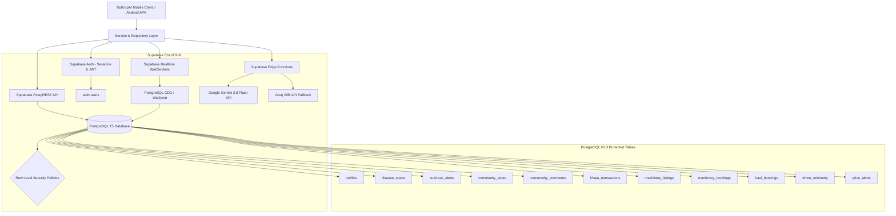

# NuKropAI — Supabase Backend Architecture & Realtime Specification

**Backend Platform:** Supabase (Self-hosted & Cloud PostgreSQL 15, PostgREST 12, Realtime V2, Storage)  
**Strict Policy:** **Zero Firebase**. No Firebase SDKs, no Google Services JSON, no Firebase Auth.

---

## 1. System Architecture

---

## 2. PostgreSQL Tables & Schemas

### 1. `profiles`
- `id` (UUID, Primary Key, references `auth.users(id)` ON DELETE CASCADE)
- `phone` (VARCHAR(20), NOT NULL, UNIQUE)
- `full_name` (VARCHAR(100), NOT NULL)
- `state` (VARCHAR(50), DEFAULT 'Telangana')
- `district` (VARCHAR(50), DEFAULT 'Warangal')
- `village` (VARCHAR(50), DEFAULT 'Hanamkonda')
- `land_extent_acres` (NUMERIC(6,2), DEFAULT 4.50)
- `preferred_language` (VARCHAR(10), DEFAULT 'te')
- `dpdp_consent_given` (BOOLEAN, DEFAULT TRUE)
- `created_at`, `updated_at` (TIMESTAMPTZ)

### 2. `disease_scans`
- `id` (UUID, Primary Key)
- `user_id` (UUID, references `profiles(id)`)
- `crop_type` (VARCHAR(50), NOT NULL)
- `diagnosis_name` (VARCHAR(100), NOT NULL)
- `confidence` (NUMERIC(4,3), CHECK >= 0 AND <= 1)
- `severity` (VARCHAR(20), DEFAULT 'MODERATE')
- `image_storage_path` (TEXT)
- `gps_latitude`, `gps_longitude` (NUMERIC(9,6))
- `recommended_treatment` (TEXT)
- `created_at` (TIMESTAMPTZ)

### 3. `haul_bookings` (GramHaul Logistics)
- `id` (VARCHAR(50), Primary Key, e.g. 'GH-4192')
- `farmer_id` (VARCHAR(50), NOT NULL)
- `driver_id` (VARCHAR(50))
- `pickup_village` (TEXT, NOT NULL)
- `destination_mandi` (TEXT, NOT NULL)
- `crop_name` (VARCHAR(100), NOT NULL)
- `load_quintals` (NUMERIC(6,2), NOT NULL CHECK > 0)
- `agreed_fare` (NUMERIC(10,2), NOT NULL CHECK > 0)
- `truck_type` (VARCHAR(100), NOT NULL)
- `status` (VARCHAR(30), DEFAULT 'PENDING' CHECK IN ('PENDING', 'ACCEPTED', 'DISPATCHED', 'IN_TRANSIT', 'COMPLETED', 'CANCELLED'))
- `pickup_lat`, `pickup_lng` (NUMERIC(9,6))
- `created_at`, `updated_at` (TIMESTAMPTZ)

### 4. `driver_telemetry`
- `id` (UUID, Primary Key)
- `driver_id` (VARCHAR(50), NOT NULL, UNIQUE)
- `driver_name` (VARCHAR(100), NOT NULL)
- `vehicle_plate` (VARCHAR(30), NOT NULL)
- `vehicle_type` (VARCHAR(100), NOT NULL)
- `current_lat`, `current_lng` (NUMERIC(9,6), NOT NULL)
- `heading` (NUMERIC(5,2), DEFAULT 0)
- `speed_kmh` (NUMERIC(5,2), DEFAULT 0)
- `is_online` (BOOLEAN, DEFAULT TRUE)
- `last_ping` (TIMESTAMPTZ)

### 5. `community_posts` & `community_comments`
- Posts: `id`, `author_id`, `crop_tag`, `title`, `description`, `media_url`, `likes_count`, `is_verified_agronomist`, `created_at`.
- Comments: `id`, `post_id`, `author_id`, `comment_text`, `role`, `created_at`.

### 6. `khata_transactions` (Digital Farm Ledger)
- `id`, `user_id`, `type` ('income' | 'expense'), `category`, `description`, `amount`, `transaction_date`, `payment_mode`, `created_at`.

---

## 3. Row Level Security (RLS) Policy Audit

| Table | SELECT Policy | INSERT Policy | UPDATE Policy | DELETE Policy |
| :--- | :--- | :--- | :--- | :--- |
| `profiles` | `auth.uid() = id` | System Auth trigger | `auth.uid() = id` | `auth.uid() = id` |
| `disease_scans` | `auth.uid() = user_id` | `auth.uid() = user_id` | Private | `auth.uid() = user_id` |
| `outbreak_alerts` | `is_active = TRUE` (Public) | Admin / System only | Admin only | Admin only |
| `community_posts` | `authenticated` (All logged-in) | `auth.uid() = author_id` | `auth.uid() = author_id` | `auth.uid() = author_id` |
| `community_comments`| `authenticated` | `auth.uid() = author_id` | Private | `auth.uid() = author_id` |
| `khata_transactions`| `auth.uid() = user_id` | `auth.uid() = user_id` | `auth.uid() = user_id` | `auth.uid() = user_id` |
| `haul_bookings` | Active matching filter | Verified farmer ID | Assigned driver / farmer | Private |
| `driver_telemetry` | `is_online = TRUE` | Authenticated driver | Driver matching ID | Driver matching ID |

---

## 4. Realtime Channels & Resilience Engine

### Active Channels
1. `realtime:community_posts`: Postgres Change Data Capture (`INSERT`, `UPDATE`) for instant feed posts and upvote counters.
2. `haul:${driverId}`: Broadcast channel for instantaneous farmer dispatch alerts (`event: 'new_haul'`).
3. `gps:${driverId}`: Presence tracking and high-frequency GPS coordinate broadcast (`event: 'gps'`) updated every 3,000ms.
4. `chat:${userEmail}`: P2P farmer-driver message exchange with receiver verification.
5. `realtime:mandi_live_rates`: Live APMC daily auction price updates.

### Resilience Hardening (`NuKropRealtimeManager`)
- **Exponential Backoff:** When network disconnection occurs in rural areas, WebSocket reconnections back off exponentially (1s, 2s, 4s, 8s, up to 30s) to prevent battery exhaustion.
- **Duplicate Protection:** Uses an in-memory sliding window cache of recent event IDs (bounded to 500 entries) preventing duplicate UI notifications or double orders.
- **Lifecycle Cleanup:** When switching screens via `openScreen`, all listeners on previous views are systematically un-subscribed to prevent memory leaks and zombie sockets.

---

## 5. Server-Side Secure AI Integration

- **Edge Function:** `supabase/functions/ai-agronomist/index.ts`
- **Routing:** All mobile AI requests dispatch to `https://yxjqseiegwjdfnccdchk.supabase.co/functions/v1/ai-agronomist` authenticated via Supabase anonymous key.
- **Key Safety:** Neither Google Gemini API keys nor Groq API keys are ever bundled into client JavaScript, HTML, or the Android APK binary. Keys are stored strictly as encrypted Supabase Project Secrets.
